# Ultimate Tech Mod

[](https://www.minecraft.net/)
[](https://files.minecraftforge.net/)
[](https://www.java.com/)
[](LICENSE)

## 📖 Описание

**Ultimate Tech** - это технологический мод для Minecraft 1.20.1, добавляющий новые материалы, инструменты, блоки и жидкости. Проект разработан с использованием Minecraft Forge, Mixin и интегрирован с EMI.

### 🎯 Основные возможности:

- ✅ **8 новых материалов** с полным набором предметов
- ✅ **Руды** в разных биомах (Overworld, Deepslate, Nether, End)
- ✅ **Полный набор инструментов** для каждого материала (меч, кирка, топор, лопата, мотыга)
- ✅ **Кастомные жидкости** (редстоун, сырая нефть) с текстурами
- ✅ **Блоки хранения** (обычные и сырые)
- ✅ **Лифт (Elevator)** с 8 вариантами для разных материалов
- ✅ **Автоматическая система регистрации** через enum
- ✅ **EMI интеграция** с категоризацией предметов

---

## 📦 Что было добавлено

### Материалы (8 типов):
- 🟦 **Кобальт** (Cobalt)
- 🟩 **Цинк** (Zinc)
- 🟫 **Мифрил** (Mithril)
- И ещё 5 других материалов

### Для каждого материала:
- **Руды:** Обычная, Deepslate, Nether, End
- **Слитки** (Ingot)
- **Материалы:** Пыль, Пластина, Самородок, Стержень, Сырьё
- **Блоки хранения:** Обычный блок, Сырой блок
- **Полный набор инструментов:** Меч, Кирка, Топор, Лопата, Мотыга

### Жидкости:
- 🔴 **REDSTONE** - красная жидкость
- ⬛ **CRUDE_OIL** - чёрная жидкость (сырая нефть)

### Специальные блоки:
- 🛗 **Elevator** - лифт для быстрого перемещения (8 вариантов)
- 🎮 **Game Items** - игровые предметы

---

## 🛠️ Технические детали

### Версии:
- **Minecraft:** 1.20.1
- **Forge:** 47.x
- **Java:** 17+
- **Язык программирования:** Java

### Архитектура:

```
enum ModFluid / ModMaterial
    ↓
RegistryInitializer (централизованная инициализация)
    ↓
ModFluidsRegistry / ModItemsUtils / ModBlockUtils
    ↓
DeferredRegister (Forge реестр)
    ↓
Ultimate Tech - готово!
```

---

## 📁 Структура проекта

```
Ultimate Tech/
├── src/main/java/org/mod/ultimate_tech/
│   ├── core/registry/
│   │   ├── RegistryInitializer.java     ← Главный инициализатор
│   │   ├── fluid/
│   │   │   ├── BaseFluidType.java       ← Управление жидкостями
│   │   │   ├── FluidTypesRegistry.java  ← Регистрация типов жидкостей
│   │   │   ├── ModFluidsRegistry.java   ← Автоматическая регистрация
│   │   │   └── ModFluidUtils.java
│   │   ├── item/
│   │   │   ├── material/                ← Генерация материальных предметов
│   │   │   └── tool/                    ← Генерация инструментов
│   │   ├── block/
│   │   │   ├── custom/                  ← Кастомные блоки (elevator)
│   │   │   └── generator/               ← Автогенерация блоков
│   │   └── ModBlockUtils.java
│   ├── common/
│   │   ├── material/ModFluid.java       ← Enum жидкостей
│   │   └── init/Registry.java
│   ├── integration/
│   │   └── emi/                         ← EMI интеграция
│   │       ├── ItemCategoryClassifier.java
│   │       └── EmiCategoryFilterController.java
│   └── mixin/
│       └── emi/EmiScreenManagerMixin.java
└── README.md
```

---

## 🚀 Начало работы

### Для игроков:

1. Установите Minecraft Forge 47.x
2. Скачайте мод JAR файл
3. Поместите в папку `mods`
4. Запустите Minecraft!

### Для разработчиков:

#### 1. Клонируйте репозиторий:
```bash
git clone https://github.com/Alex-12358/Ultimate-Tech.git
cd "Ultimate Tech"
```

#### 2. Сгенерируйте IDE файлы:
```bash
./gradlew genIntellijRuns
```

#### 3. Откройте проект в IntelliJ IDEA

#### 4. Запустите `runClient`

---

## 📚 Система регистрации материалов

### Автоматическая генерация:

#### 1️⃣ Добавьте материал в enum (если нужен новый):

```java
// ModMaterial.java
COBALT(true, true, true, true, true);  
// ore, ingot, block, tool, fluid
```

#### 2️⃣ Система **автоматически создаст:**

✅ Руды (обычная, deepslate, nether, end)
✅ Слитки
✅ Блоки хранения
✅ Все инструменты (меч, кирка, топор, лопата, мотыга)
✅ Материалы (пыль, пластины, самородки, стержни, сырьё)

**Готово!** Ничего больше не нужно писать! 🎉

---

## 💧 Система регистрации жидкостей

### Автоматическая регистрация жидкостей:

#### 1️⃣ Добавьте в `ModFluid.java` enum:

```java
public enum ModFluid {
    REDSTONE(true),
    CRUDE_OIL(true),
    ZINC(true),        // ← Новая жидкость
    ;
    // ...остальное...
}
```

#### 2️⃣ Добавьте в `FluidTypesRegistry.java`:

```java
public static final RegistryObject<FluidType> ZINC_FLUID_TYPE =
        FLUID_TYPES.register("zinc_fluid", () -> new BaseFluidType(
                new ResourceLocation(MOD_ID, "block/zinc_fluid_still"),
                new ResourceLocation(MOD_ID, "block/zinc_fluid_flowing"),
                new ResourceLocation(MOD_ID, "block/zinc_fluid_overlay"),
                0xFF888888  // Цвет (серый)
        ));
```

#### 3️⃣ В метод `getFluidType()`:

```java
if (fluid == ModFluid.ZINC) {
    return ZINC_FLUID_TYPE.get();
}
```

#### 4️⃣ Создайте текстуры:

```
assets/ultimate_tech/textures/block/
- zinc_fluid_still.png (256x256)
- zinc_fluid_flowing.png (256x256)
- zinc_fluid_overlay.png (256x256)
```

#### ✨ Всё! Жидкость автоматически создана с:
- Source жидкость
- Flowing жидкость
- Блок жидкости
- Ведро

---

## 🔍 EMI Интеграция

### Категории поиска:

| Категория | Описание |
|-----------|---------|
| **Ores** | Все руды из всех биомов |
| **Ingots** | Все слитки |
| **Materials** | Пыль, пластины, самородки, стержни, сырьё |
| **Tools** | Все инструменты |
| **Fluids** | Все жидкости |

### Использование в EMI:

1. Откройте инвентарь (E)
2. В EMI нажмите категорию слева
3. Видите только предметы этой категории!

---

## 🎨 Текстуры жидкостей

### Требования:

- **Размер:** 256x256 пикселей
- **Формат:** PNG 32-bit (RGBA)
- **Типы:** Still, Flowing, Overlay

### Текущие жидкости:

| Жидкость | Цвет | RGB Hex |
|----------|------|---------|
| **REDSTONE** | Красная | 0xFFFF0000 |
| **CRUDE_OIL** | Чёрная | 0xFF1a1a1a |

---

## 📊 Статистика

### Генерируется автоматически:
- **Материальные предметы:** 8 материалов × 6 типов = 48 предметов
- **Инструменты:** 8 материалов × 5 типов = 40 инструментов
- **Блоки:** 8 материалов × 8 типов = 64 блока
- **Жидкости:** 2 жидкости = 6 компонентов (source, flowing, block, bucket × 2)

**Всего:** 150+ предметов и блоков!

---

## 🔧 Конфигурация

### `gradle.properties`:
```properties
minecraft_version=1.20.1
forge_version=47.4.10
loader_version_range=[0,)
```

### `build.gradle`:
```gradle
minecraft {
    version = "1.20.1-47.4.10"
}
```

---

## 🐛 Известные проблемы

- Пока нет известных критических багов

---

## 📝 TODO

- [ ] Добавить крафт рецепты
- [ ] Добавить звуковые эффекты
- [ ] Оптимизировать текстуры
- [ ] Добавить еду (SOON)
- [ ] Добавить больше материалов

---
## Oil Diagram 

```mermaid
flowchart LR
    %% ==================== ГЛАВНЫЙ УЗЕЛ ====================
    A["🛢️ СЫРАЯ НЕФТЬ<br>Исходный ресурс<br>Добывается ведром из озёр"]

    %% ==================== КЛАССИФИКАЦИИ ====================
    A --> B["⚖️ ПО ПЛОТНОСТИ<br>Текстура жидкости"]
    A --> C["🧪 ПО СОДЕРЖАНИЮ СЕРЫ<br>Цвет частиц"]
    A --> D["🔬 ПО ХИМИЧЕСКОМУ СОСТАВУ<br>Свойства переработки"]
    A --> E["📍 ПО ТОВАРНОЙ МАРКЕ<br>Биом генерации"]
    A --> F["🧭 ПО ГЕОГРАФИИ<br>Месторождения в мире"]
    A --> G["⚙️ ПРОДУКТЫ ПЕРЕГОНКИ<br>в Перегонном кубе"]

    %% ==================== ПЛОТНОСТЬ ====================
    subgraph P["⚖️ КЛАССИФИКАЦИЯ ПО ПЛОТНОСТИ"]
        direction TB
        B1["🟡 ЛЁГКАЯ НЕФТЬ<br>Light Crude<br>Текстура: Светло-коричневая"]
        B2["🟠 СРЕДНЯЯ НЕФТЬ<br>Medium Crude<br>Текстура: Тёмно-коричневая"]
        B3["🟤 ТЯЖЁЛАЯ НЕФТЬ<br>Heavy Crude<br>Текстура: Почти чёрная"]
        B4["⚫ СВЕРХТЯЖЁЛАЯ<br>Bitumen<br>Текстура: Чёрная с крапинками"]

        B1 --> B1a["Скорость течения:<br>Как вода"]
        B1 --> B1b["Время горения в печи:<br>12 предметов"]
        B1 --> B1c["Выход при перегонке:<br>⛽ Бензин: 4 ведра<br>🚛 Дизель: 2 ведра<br>🛢️ Мазут: 1 ведро"]

        B2 --> B2a["Скорость течения:<br>Как лава (медленно)"]
        B2 --> B2b["Время горения в печи:<br>16 предметов"]
        B2 --> B2c["Выход при перегонке:<br>⛽ Бензин: 2 ведра<br>🚛 Дизель: 3 ведра<br>🛢️ Мазут: 2 ведра"]

        B3 --> B3a["Скорость течения:<br>Очень медленная"]
        B3 --> B3b["Время горения в печи:<br>20 предметов"]
        B3 --> B3c["Выход при перегонке:<br>⛽ Бензин: 1 ведро<br>🚛 Дизель: 2 ведра<br>🛢️ Мазут: 3 ведра<br>🛣️ Битум: 1 блок"]

        B4 --> B4a["Скорость течения:<br>Не течёт (твёрдый блок)"]
        B4 --> B4b["Время горения в печи:<br>24 предмета"]
        B4 --> B4c["Выход при перегонке:<br>⛽ Бензин: 0 вёдер<br>🚛 Дизель: 1 ведро<br>🛢️ Мазут: 2 ведра<br>🛣️ Битум: 3 блока"]
    end

    %% ==================== СЕРА ====================
    subgraph S["🧪 КЛАССИФИКАЦИЯ ПО СОДЕРЖАНИЮ СЕРЫ"]
        direction TB
        C1["🟢 МАЛОСЕРНИСТАЯ<br>Sweet<br>Частицы: Белый дым"]
        C2["🟡 СЕРНИСТАЯ<br>Sour<br>Частицы: Серый дым"]
        C3["🔴 ВЫСОКОСЕРНИСТАЯ<br>High Sour<br>Частицы: Жёлтый дым + урон"]

        C1 --> C1a["Эффект при горении:<br>Без эффектов"]
        C1 --> C1b["Очистка:<br>Не требуется"]
        C1 --> C1c["Ценность:<br>💎💎💎 (×3 изумруда)"]

        C2 --> C2a["Эффект при горении:<br>☠️ Слабость I (5 сек)<br>если стоять в дыму"]
        C2 --> C2b["Очистка:<br>Ведро серной нефти +<br>Угольный фильтр"]
        C2 --> C2c["Ценность:<br>💎💎 (×2 изумруда)"]

        C3 --> C3a["Эффект при горении:<br>☠️ Отравление I (5 сек)<br>в радиусе 3 блоков"]
        C3 --> C3b["Очистка:<br>Требуется Гидроочистка<br>(спец. установка)"]
        C3 --> C3c["Побочный продукт:<br>🟡 Сера (порох / краситель)"]
        C3 --> C3d["Ценность:<br>💎 (×1 изумруд)"]
    end

    %% ==================== ХИМИЧЕСКИЙ СОСТАВ ====================
    subgraph Ch["🔬 КЛАССИФИКАЦИЯ ПО ХИМИЧЕСКОМУ СОСТАВУ"]
        direction TB
        D1["🧊 ПАРАФИНОВАЯ<br>Много воска"]
        D2["💧 НАФТЕНОВАЯ<br>Много масел"]
        D3["💠 АРОМАТИЧЕСКАЯ<br>Много растворителей"]
        D4["🔄 СМЕШАННАЯ<br>Универсальная"]

        D1 --> D1a["Особенность перегонки:<br>Выпадает Парафин"]
        D1 --> D1b["Продукты:<br>🕯️ Свечи (вечный факел)<br>📜 Вощёная бумага<br>⚙️ Смазка для поршней"]
        D1 --> D1c["Крафт свечи:<br>🧵 Нить + 🧊 Парафин"]

        D2 --> D2a["Особенность перегонки:<br>Выпадает Смазочное масло"]
        D2 --> D2b["Продукты:<br>🛢️ Моторное масло<br>⚡ Трансформаторное масло<br>🔧 Ускоритель механизмов"]
        D2 --> D2c["Применение масла:<br>🚂 Ускорение вагонеток<br>🔩 Уменьшение трения поршней"]

        D3 --> D3a["Особенность перегонки:<br>Выпадает Растворитель"]
        D3 --> D3b["Продукты:<br>🎨 Красители всех цветов<br>🧴 Пластик высокого качества<br>🩹 Клей"]
        D3 --> D3c["Применение:<br>🧹 Снятие краски с блоков<br>🔨 Создание пластика"]

        D4 --> D4a["Особенность перегонки:<br>Стандартный выход<br>всех фракций"]
        D4 --> D4b["Продукты:<br>⛽ Бензин, 🚛 Дизель, 🛢️ Мазут<br>в равных пропорциях"]
        D4 --> D4c["📦 Универсальное сырьё"]
    end

    %% ==================== ТОВАРНЫЕ МАРКИ ====================
    subgraph M["📍 КЛАССИФИКАЦИЯ ПО ТОВАРНОЙ МАРКЕ (БИОМЫ)"]
        direction TB
        E1["🌿 BRENT<br>Биом: Равнины / Лес"]
        E2["🏜️ WTI<br>Биом: Пустыня / Меза"]
        E3["🏝️ DUBAI<br>Биом: Пляж / Океан"]
        E4["❄️ URALS<br>Биом: Тайга / Тундра"]
        E5["🌲 ESPO<br>Биом: Тигровая тайга"]
        E6["🏔️ WCS<br>Биом: Горы / Пещеры"]

        E1 --> E1a["Тип: 🟡 Лёгкая<br>Сера: 🟢 Малосернистая<br>Глубина: Y=40-60"]
        E1 --> E1b["Цена у жителя:<br>💎💎💎💎 (4 изумруда)"]

        E2 --> E2a["Тип: 🟡 Очень лёгкая<br>Сера: 🟢 Сверхмалосернистая<br>Глубина: Y=30-50"]
        E2 --> E2b["Цена у жителя:<br>💎💎💎💎💎 (5 изумрудов)"]

        E3 --> E3a["Тип: 🟠 Средняя<br>Сера: 🟡 Сернистая<br>Глубина: Y=20-40<br>🌊 Под водой"]
        E3 --> E3b["Цена у жителя:<br>💎💎💎 (3 изумруда)"]

        E4 --> E4a["Тип: 🟤 Среднетяжёлая<br>Сера: 🔴 Высокосернистая<br>Глубина: Y=30-50"]
        E4 --> E4b["Цена у жителя:<br>💎💎 (2 изумруда)"]

        E5 --> E5a["Тип: 🟡 Лёгкая<br>Сера: 🟢 Малосернистая<br>Глубина: Y=40-60"]
        E5 --> E5b["Цена у жителя:<br>💎💎💎💎 (4 изумруда)"]

        E6 --> E6a["Тип: ⚫ Сверхтяжёлая<br>Сера: 🔴 Высокосернистая<br>Глубина: Y=10-30"]
        E6 --> E6b["Цена у жителя:<br>💎 (1 изумруд)"]
    end

    %% ==================== ГЕОГРАФИЯ ====================
    subgraph Geo["🧭 КЛАССИФИКАЦИЯ ПО ГЕОГРАФИИ (МЕСТОРОЖДЕНИЯ)"]
        direction TB
        F1["🏜️ ПУСТЫННЫЕ<br>МЕСТОРОЖДЕНИЯ"]
        F2["🌲 ЛЕСНЫЕ<br>МЕСТОРОЖДЕНИЯ"]
        F3["❄️ СНЕЖНЫЕ<br>МЕСТОРОЖДЕНИЯ"]
        F4["🌊 ОКЕАНИЧЕСКИЕ<br>МЕСТОРОЖДЕНИЯ"]
        F5["⛰️ ГОРНЫЕ<br>МЕСТОРОЖДЕНИЯ"]
        F6["🕳️ ГЛУБИННЫЕ<br>МЕСТОРОЖДЕНИЯ"]
        F7["🔥 НИЖНЕГО МИРА<br>МЕСТОРОЖДЕНИЯ"]

        F1 --> F1a["Структура:<br>🛢️ Нефтяные озёра<br>на поверхности"]
        F1 --> F1b["Тип нефти:<br>🏜️ WTI, 🏝️ Dubai<br>(Лёгкие и средние)"]
        F1 --> F1c["Объём озера:<br>🪣 10-30 вёдер"]

        F2 --> F2a["Структура:<br>⏳ Нефтеносный песок<br>под землёй"]
        F2 --> F2b["Тип нефти:<br>🌿 Brent, 🌲 ESPO<br>(Лёгкие)"]
        F2 --> F2c["Добыча:<br>🪣 Лопатой с блока песка"]

        F3 --> F3a["Структура:<br>🧊 Замёрзшая нефть<br>в вечной мерзлоте"]
        F3 --> F3b["Тип нефти:<br>❄️ Urals<br>(Среднетяжёлая)"]
        F3 --> F3c["Особенность:<br>⛏️ Требуется кирка<br>с Шёлковым касанием"]

        F4 --> F4a["Структура:<br>💨 Подводные гейзеры<br>чёрной жидкости"]
        F4 --> F4b["Тип нефти:<br>🏝️ Dubai, Морские сорта<br>(Средние)"]
        F4 --> F4c["Опасность:<br>😤 Удушье при сборе<br>без зачарования"]

        F5 --> F5a["Структура:<br>🪨 Горючий сланец<br>в скалах"]
        F5 --> F5b["Тип нефти:<br>🏔️ WCS, Тяжёлые сорта<br>(Сверхтяжёлая)"]
        F5 --> F5c["Добыча:<br>⚙️ Дробление блока<br>сланца в дробилке"]

        F6 --> F6a["Структура:<br>🕳️ Нефтяные карманы<br>на Y=-30 и ниже"]
        F6 --> F6b["Тип нефти:<br>🔄 Смешанные типы<br>Склонность к тяжёлым"]
        F6 --> F6c["Объём:<br>🪣 Крупные залежи<br>50-100 вёдер"]

        F7 --> F7a["Структура:<br>🔥 Озёра адской нефти<br>в Нижнем мире"]
        F7 --> F7b["Тип нефти:<br>👹 Особая — Демоническая<br>Горит вечно"]
        F7 --> F7c["Эффект при контакте:<br>🔥 Поджог на 10 сек"]
        F7 --> F7d["Применение:<br>♾️ Вечное топливо<br>для адских механизмов"]
    end

    %% ==================== ПРОДУКТЫ ПЕРЕГОНКИ ====================
    subgraph Prod["⚙️ ПРОДУКТЫ ПЕРЕГОНКИ В ПЕРЕГОННОМ КУБЕ"]
        direction TB
        G1["⛽ БЕНЗИН<br>Ведро бензина"]
        G2["🚛 ДИЗЕЛЬ<br>Ведро дизеля"]
        G3["🛢️ МАЗУТ<br>Ведро мазута"]
        G4["🛣️ БИТУМ<br>Блок асфальта"]
        G5["🧪 НЕФТЯНОЙ ГАЗ<br>Газовый баллон"]
        G6["🟡 СЕРА<br>Порошок серы"]

        G1 --> G1a["Топливо для:<br>🚗 Бензинового двигателя<br>⚡ Генератора<br>🏎️ Автомобилей"]
        G1 --> G1b["Горение:<br>🔥 8 предметов"]

        G2 --> G2a["Топливо для:<br>⚡ Дизельного генератора<br>🚛 Грузовиков<br>🏭 Промышленных печей"]
        G2 --> G2b["Горение:<br>🔥 12 предметов"]

        G3 --> G3a["Топливо для:<br>♨️ Котлов<br>🚂 Паровых машин<br>🏭 Теплоэлектростанций"]
        G3 --> G3b["Горение:<br>🔥 16 предметов"]

        G4 --> G4a["Крафт блока:<br>🛢️ 4 Мазута + 🪨 4 Гравия"]
        G4 --> G4b["Эффект блока:<br>⚡ Скорость II<br>при ходьбе"]

        G5 --> G5a["Применение:<br>🔥 Газовый факел (свет)<br>🍳 Газовая плита<br>🔫 Огнемёт"]
        G5 --> G5b["Крафт факела:<br>🥢 Палка + 🧪 Газовый баллон"]

        G6 --> G6a["Применение:<br>💣 Крафт пороха<br>🎨 Жёлтый краситель<br>🌱 Удобрения"]
        G6 --> G6b["Крафт пороха:<br>🟡 Сера + 🪨 Уголь + 🧂 Селитра"]
    end

    %% ==================== СВЯЗИ С ПОДГРАФАМИ ====================
    B --> P
    C --> S
    D --> Ch
    E --> M
    F --> Geo
    G --> Prod

    %% ==================== СТИЛИ ====================
    style A fill:#2c1e16,color:#ffd700,stroke:#e2a33b,stroke-width:4px
    
    style B fill:#3d5a3d,color:#fff,stroke:#5a8f5a,stroke-width:2px
    style C fill:#5a4a3d,color:#fff,stroke:#8f7a5a,stroke-width:2px
    style D fill:#4a3d5a,color:#fff,stroke:#7a5a8f,stroke-width:2px
    style E fill:#5a3d4a,color:#fff,stroke:#8f5a7a,stroke-width:2px
    style F fill:#3d4a5a,color:#fff,stroke:#5a7a8f,stroke-width:2px
    style G fill:#5a3d3d,color:#fff,stroke:#8f5a5a,stroke-width:2px

    style P fill:#2a3a2a,color:#e0e0e0,stroke:#4a7a4a,stroke-width:2px
    style S fill:#3a3020,color:#e0e0e0,stroke:#7a6a3a,stroke-width:2px
    style Ch fill:#30203a,color:#e0e0e0,stroke:#6a3a7a,stroke-width:2px
    style M fill:#3a2030,color:#e0e0e0,stroke:#7a3a6a,stroke-width:2px
    style Geo fill:#20303a,color:#e0e0e0,stroke:#3a6a7a,stroke-width:2px
    style Prod fill:#3a2020,color:#e0e0e0,stroke:#7a3a3a,stroke-width:2px
```


---

## 🙏 Спасибо

- **Kaupenjoe**
- **Forge Team**
- **Minecraft Community**

---

## 📄 Лицензия

Проект лицензирован под MIT License

---

Made with ❤️ by Ultimate Tech Team

**Последнее обновление:** 2026-04-09 | **Версия:** 1.0.0

