# Ultimate Tech Mod

[](https://www.minecraft.net/)
[](https://files.minecraftforge.net/)
<<<<<<< Updated upstream
[](https://www.java.com/)
=======
[](https://www.java.com/)
>>>>>>> Stashed changes
[](LICENSE)

***Содержание***

- [🎮 Ultimate Tech Mod](#-ultimate-tech-mod)
  - [📖 Описание](#-описание)
  - [📦 Что было добавлено](#-что-было-добавлено)
  - [🛠️ Технические детали](#️-технические-детали)
  - [📁 Структура проекта](#-структура-проекта)
  - [🚀 Начало работы](#-начало-работы)
  - [📚 Система регистрации материалов](#-система-регистрации-материалов)
  - [💧 Система регистрации жидкостей](#-система-регистрации-жидкостей)
  - [🔍 EMI Интеграция](#-emi-интеграция)
  - [🎨 Текстуры жидкостей](#-текстуры-жидкостей)
  - [📊 Статистика](#-статистика)
  - [🔧 Конфигурация](#-конфигурация)
  - [🐛 Известные проблемы](#-известные-проблемы)
  - [📝 TODO](#-todo)
  - [🛢️ Нефтяная диаграмма](#️-нефтяная-диаграмма-oil-diagram)
  - [🛠️ Архитектура системы регистрации](#️-архитектура-системы-регистрации)
  - [📄 Лицензия](#-лицензия)
  - [💬 Контакты и ссылки](#-контакты-и-ссылки)
## 📖 Описание

>**Ultimate Tech** - это технологический мод для Minecraft 1.20.1, добавляющий новые материалы, инструменты, блоки и жидкости. Проект разработан с использованием Minecraft Forge, Mixin и интегрирован с EMI.

### 🎯 Основные возможности:

- ✅ **8 новых материалов** с полным набором предметов
- ✅ **Руды** в разных биомах (Overworld, Deepslate, Nether, End)
- ✅ **Полный набор инструментов** для каждого материала (меч, кирка, топор, лопата, мотыга)
- ✅ **Кастомные жидкости** (редстоун, сырая нефть) с текстурами
- ✅ **Блоки хранения** (обычные и сырые)
- ✅ **Лифт (Elevator)** с 8 вариантами для разных материалов
- ✅ **Автоматическая система регистрации** через enum
- ✅ **EMI интеграция** с категоризацией предметов

---

## 📦 Что было добавлено

### Материалы (8 типов):
- 🟦 **Кобальт** (Cobalt)
- 🟩 **Цинк** (Zinc)
- 🟫 **Мифрил** (Mithril)
- И ещё 5 других материалов

### Для каждого материала:
- **Руды:** Обычная, Deepslate, Nether, End
- **Слитки** (Ingot)
- **Материалы:** Пыль, Пластина, Самородок, Стержень, Сырьё
- **Блоки хранения:** Обычный блок, Сырой блок
- **Полный набор инструментов:** Меч, Кирка, Топор, Лопата, Мотыга

### Жидкости:
- 🔴 **REDSTONE** - красная жидкость
- ⬛ **CRUDE_OIL** - чёрная жидкость (сырая нефть)

### Специальные блоки:
- 🛗 **Elevator** - лифт для быстрого перемещения (8 вариантов)
- 🎮 **Game Items** - игровые предметы

---

## 🛠️ Технические детали

### Версии:
- **Minecraft:** 1.20.1
- **Forge:** 47.4.10
- **Java:** 17+
- **EMI:** 1.1.22+1.20.1
- **Botarium:** 2.3.4
- **Fusion:** 1.2.5
- **Язык программирования:** Java
- **Mapping:** Parchment 2023.09.03

### Архитектура:

```mermaid
flowchart TB
<<<<<<< Updated upstream
    ENUM["📋 Enum<br/>ModMaterial<br/>ModFluid"]
    
    INIT["🔧 RegistryInitializer<br/>(Централизованная инициализация)"]
    
    UTILS["⚙️ Utils<br/>ModFluidUtils<br/>ModItemsUtils<br/>ModBlockUtils"]
    
    REGISTRY["📦 Registry<br/>ModFluidsRegistry<br/>ModItemsRegistry<br/>ModBlocksRegistry"]
    
    DEFER["🎯 DeferredRegister<br/>(Forge реестр)"]
    
    FINAL["✅ Ultimate Tech<br/>Полностью готово!"]
    
    ENUM --> INIT
    INIT --> UTILS
    UTILS --> REGISTRY
    REGISTRY --> DEFER
    DEFER --> FINAL
    
    style ENUM fill:#3498db,color:#fff,stroke:#2980b9,stroke-width:2px
    style INIT fill:#e74c3c,color:#fff,stroke:#c0392b,stroke-width:2px
    style UTILS fill:#f39c12,color:#fff,stroke:#d68910,stroke-width:2px
    style REGISTRY fill:#9b59b6,color:#fff,stroke:#8e44ad,stroke-width:2px
    style DEFER fill:#27ae60,color:#fff,stroke:#229954,stroke-width:2px
    style FINAL fill:#16a085,color:#fff,stroke:#117a65,stroke-width:2px
=======
  ENUM["📋 Enum<br/>ModMaterial<br/>ModFluid"]:::enum
  INIT["🔧 RegistryInitializer<br/>Централизованная инициализация"]:::init
  UTILS["⚙️ Utils<br/>ModFluidUtils<br/>ModItemsUtils<br/>ModBlockUtils"]:::utils
  REGISTRY["📦 Registry<br/>ModFluidsRegistry<br/>ModItemsRegistry<br/>ModBlocksRegistry"]:::registry
  DEFER["🎯 DeferredRegister<br/>Forge реестр"]:::defer
  FINAL["✅ Ultimate Tech<br/>Полностью готово!"]:::final

  ENUM --> INIT
  INIT --> UTILS
  UTILS --> REGISTRY
  REGISTRY --> DEFER
  DEFER --> FINAL

  classDef enum fill:#4a1e2c,color:#f1948a,stroke:#e74c3c,stroke-width:2px,r:8px
  classDef init fill:#5d3a1a,color:#f0c27f,stroke:#e67e22,stroke-width:2px,r:8px
  classDef utils fill:#1a4a5a,color:#7fdbda,stroke:#1abc9c,stroke-width:2px,r:8px
  classDef registry fill:#3a2a5a,color:#d2b4de,stroke:#9b59b6,stroke-width:2px,r:8px
  classDef defer fill:#1e4a3a,color:#a3e4d7,stroke:#2ecc71,stroke-width:2px,r:8px
  classDef final fill:#5a4a1a,color:#f9e79f,stroke:#f1c40f,stroke-width:3px,r:10px
>>>>>>> Stashed changes
```

---

## 📁 Структура проекта

```mermaid
flowchart LR
<<<<<<< Updated upstream
    ROOT["📁 Ultimate Tech"]
    
    ROOT --> SRC["📁 src/main"]
    ROOT --> GRADLE["📄 build.gradle"]
    
    SRC --> JAVA["📁 java"]
    SRC --> RES["📁 resources"]
    
    JAVA --> ORG["📁 org/mod/ultimate_tech/"]
    
    ORG --> CORE["📁 core/"]
    ORG --> COMMON["📁 common/"]
    ORG --> CLIENT["📁 client/"]
    ORG --> INTEG["📁 integration/"]
    ORG --> MIXIN["📁 mixin/"]
    ORG --> MAIN["🔧 Ultimate_tech.java"]
    
    CORE --> REGISTRY["📁 registry/"]
    REGISTRY --> INIT["RegistryInitializer.java"]
    REGISTRY --> FLUID_R["📁 fluid/"]
    REGISTRY --> ITEM_R["📁 item/"]
    REGISTRY --> BLOCK_R["📁 block/"]
    
    COMMON --> MATERIAL["📁 material/"]
    MATERIAL --> MMAT["ModMaterial.java"]
    MATERIAL --> MFLUID["ModFluid.java"]
    
    RES --> ASSETS["📁 assets/"]
    RES --> DATA["📁 data/"]
    ASSETS --> TEX["📁 textures/"]
    DATA --> REC["📁 recipes/"]
    
    style ROOT fill:#34495e,color:#fff
    style SRC fill:#3498db,color:#fff
    style JAVA fill:#2980b9,color:#fff
    style RES fill:#9b59b6,color:#fff
    style CORE fill:#e74c3c,color:#fff
    style COMMON fill:#f39c12,color:#fff
    style CLIENT fill:#27ae60,color:#fff
    style INTEG fill:#c0392b,color:#fff
    style MIXIN fill:#16a085,color:#fff
```

### Полная структура директорий:

```
src/main/java/org/mod/ultimate_tech/
├── core/
│   ├── registry/
│   │   ├── RegistryInitializer.java (централизованная инициализация)
│   │   ├── ModFluidUtils.java
│   │   ├── ModItemsUtils.java
│   │   ├── ModBlockUtils.java
│   │   ├── fluid/
│   │   │   ├── BaseFluidType.java
│   │   │   ├── FluidTypesRegistry.java
│   │   │   └── ModFluidsRegistry.java
│   │   ├── item/
│   │   │   ├── material/
│   │   │   └── tool/
│   │   └── block/
│   │       ├── custom/ (Elevator)
│   │       └── generator/
│   └── datagen/ (для автогенерации)
├── common/
│   ├── material/
│   │   ├── ModMaterial.java (enum материалов)
│   │   ├── ModFluid.java (enum жидкостей)
│   │   ├── ModRecipes.java
│   │   └── ItemType.java
│   ├── init/
│   │   ├── Registry.java
│   │   └── ModConfig.java
│   └── network/
│       └── NetworkHandler.java
├── client/
│   ├── ui/
│   │   ├── ModCreativeTabs.java
│   │   ├── ModCreativeTabTools.java
│   │   ├── ModCreativeTabItems.java
│   │   ├── ModCreativeTabFluid.java
│   │   ├── ModCreativeTabBlocks.java
│   │   └── screen/
│   └── renderer/
├── integration/
│   ├── emi/ (EMI интеграция)
│   │   ├── ItemCategoryClassifier.java
│   │   └── EmiCategoryFilterController.java
│   └── botarium/ (для блоков с сущностями)
│       └── ModBlockEntities.java
├── mixin/
│   └── emi/
│       └── EmiScreenManagerMixin.java
├── Config.java
└── Ultimate_tech.java (главный класс мода)

src/main/resources/
├── META-INF/
│   ├── mods.toml
│   ├── services/ (SPI для EMI плагина)
│   └── accesstransformer.cfg
├── assets/ultimate_tech/
│   ├── textures/
│   │   ├── block/ (текстуры блоков и жидкостей)
│   │   ├── item/ (текстуры предметов)
│   │   └── gui/ (UI текстуры)
│   ├── models/ (JSON модели блоков и предметов)
│   ├── blockstates/ (состояния блоков)
│   └── lang/
│       └── en_us.json (локализация)
├── data/ultimate_tech/
│   └── recipes/ (рецепты крафта - генерируются автоматически)
├── ultimate_tech.mixins.json (конфиг Mixin)
└── emi.mixins.json (конфиг Mixin для EMI)
=======
%% Корень
  ROOT["<b>📁 Ultimate Tech</b><br/>корень проекта"]:::root

  ROOT ---> SRC["📂 src/main"]:::folder
  ROOT --> GRADLE["📄 build.gradle"]:::file

  SRC --> JAVA["☕ java/.../ultimate_tech"]:::folder
  SRC -------> RES["📦 resources"]:::folder

%% Java Source
  JAVA -----> CORE["🧩 core"]:::core
  JAVA --> COMMON["📚 common"]:::common
  JAVA -----> CLIENT["🖥️ client"]:::client
  JAVA --> INTEG["🔌 integration"]:::integ
  JAVA --> MIXIN["🧬 mixin"]:::mixin
  JAVA --> MAIN["⚡ Ultimate_tech.java"]:::main
  JAVA --> CONFIG["⚙️ Config.java"]:::file

%% Core
  CORE --> REG["📁 registry"]:::folder
  CORE --> DATAGEN["📁 datagen"]:::folder

  REG --> R_INIT["RegistryInitializer.java"]:::file
  REG --> R_UTILS_F["ModFluidUtils.java"]:::file
  REG --> R_UTILS_I["ModItemsUtils.java"]:::file
  REG --> R_UTILS_B["ModBlockUtils.java"]:::file
  REG --> FLUID_DIR["💧 fluid"]:::folder
  REG --> ITEM_DIR["🧱 item"]:::folder
  REG ---> BLOCK_DIR["🧊 block"]:::folder

  FLUID_DIR --> F_BASE["BaseFluidType.java"]:::file
  FLUID_DIR --> F_TYPES["FluidTypesRegistry.java"]:::file
  FLUID_DIR --> F_REG["ModFluidsRegistry.java"]:::file

  ITEM_DIR --> I_MAT["material"]:::folder
  ITEM_DIR --> I_TOOL["tool"]:::folder

  BLOCK_DIR --> B_CUST["custom (Elevator)"]:::folder
  BLOCK_DIR --> B_GEN["generator"]:::folder

%% Common
  COMMON --> CM_MAT["🧬 material"]:::folder
  COMMON --> CM_INIT["init"]:::folder
  COMMON --> CM_NET["🌐 network"]:::folder

  CM_MAT --> MAT_ENUM["ModMaterial.java"]:::file
  CM_MAT --> FLUID_ENUM["ModFluid.java"]:::file
  CM_MAT --> RECIPES["ModRecipes.java"]:::file
  CM_MAT --> ITEM_TYPE["ItemType.java"]:::file

  CM_INIT --> IN_REG["Registry.java"]:::file
  CM_INIT --> IN_CONF["ModConfig.java"]:::file

  CM_NET --> NET_HANDLER["NetworkHandler.java"]:::file

%% Client
  CLIENT --> CL_UI["🎨 ui"]:::folder
  CLIENT --> CL_RENDER["renderer"]:::folder

  CL_UI --> UI_TABS["ModCreativeTabs.java"]:::file
  CL_UI --> UI_TAB_T["ModCreativeTabTools.java"]:::file
  CL_UI --> UI_TAB_I["ModCreativeTabItems.java"]:::file
  CL_UI --> UI_TAB_F["ModCreativeTabFluid.java"]:::file
  CL_UI --> UI_TAB_B["ModCreativeTabBlocks.java"]:::file
  CL_UI --> UI_SCREEN["screen"]:::folder

%% Integration
  INTEG --> INT_EMI["🔍 emi"]:::folder
  INTEG --> INT_BOT["botarium"]:::folder

  INT_EMI --> EMI1["ItemCategoryClassifier.java"]:::file
  INT_EMI --> EMI2["EmiCategoryFilterController.java"]:::file

  INT_BOT --> BOT_ENT["ModBlockEntities.java"]:::file

%% Mixin
  MIXIN --> MIX_EMI_DIR["emi"]:::folder
  MIX_EMI_DIR --> MIX_EMI_MGR["EmiScreenManagerMixin.java"]:::file

%% Resources
  RES ---> META["📄 META-INF"]:::folder
  RES ---> ASSETS["🎮 assets/ultimate_tech"]:::folder
  RES --> DATA["📊 data/ultimate_tech"]:::folder
  RES --> MIX_CFG["ultimate_tech.mixins.json"]:::file
  RES --> EMI_CFG["emi.mixins.json"]:::file

  META --> META_TOML["mods.toml"]:::file
  META --> SERVICES["services (SPI)"]:::folder
  META --> AT["accesstransformer.cfg"]:::file

  ASSETS --> A_TEX["🖼️ textures"]:::folder
  ASSETS --> A_MODELS["models"]:::folder
  ASSETS --> A_BS["blockstates"]:::folder
  ASSETS --> A_LANG["lang"]:::folder

  A_TEX --> TEX_BLOCK["block"]:::folder
  A_TEX --> TEX_ITEM["item"]:::folder
  A_TEX --> TEX_GUI["gui"]:::folder

  A_LANG --> LANG_EN["en_us.json"]:::file

  DATA --> RECIPES_DIR["recipes"]:::folder

%% Стили
  classDef root fill:#0f0f1a,color:#ffd966,stroke:#f1c40f,stroke-width:3px,r:12px,font-weight:bold
  classDef folder fill:#1a1a2e,color:#e0e0ff,stroke:#4a6a8a,stroke-width:1.5px,r:8px
  classDef file fill:#252540,color:#ccc,stroke:#6a6a8a,stroke-width:1px,r:4px
  classDef core fill:#3a1e2c,color:#f5b7b1,stroke:#e74c3c,stroke-width:2px,r:8px
  classDef common fill:#4a2e1a,color:#fad7a1,stroke:#e67e22,stroke-width:2px,r:8px
  classDef client fill:#1e3a2e,color:#a3e4d7,stroke:#2ecc71,stroke-width:2px,r:8px
  classDef integ fill:#1a3a4a,color:#7fdbda,stroke:#1abc9c,stroke-width:2px,r:8px
  classDef mixin fill:#2e1e4a,color:#d2b4de,stroke:#9b59b6,stroke-width:2px,r:8px
  classDef main fill:#4a3a1a,color:#f9e79f,stroke:#f1c40f,stroke-width:3px,r:10px
>>>>>>> Stashed changes
```

---

## 🚀 Начало работы

### Процесс работы мода:

```mermaid
flowchart TD
<<<<<<< Updated upstream
    START["🎮 Запуск Minecraft"] --> LOAD["📦 Forge загружает моды"]
    LOAD --> INIT["🔧 Ultimate Tech инициализируется"]
    INIT --> REG["📋 RegistryInitializer читает enum"]
    REG --> CREATE["✨ Создаются все предметы/блоки"]
    CREATE --> DEFER["🎯 DeferredRegister регистрирует"]
    DEFER --> CLIENT["🖥️ ClientSetup инициализация"]
    CLIENT --> READY["✅ Мод полностью готов!"]
    
    REG -.->|EMI| EMI["📖 EMI категоризирует рецепты"]
    EMI --> READY
    
    style START fill:#3498db,color:#fff
    style LOAD fill:#e74c3c,color:#fff
    style INIT fill:#f39c12,color:#fff
    style REG fill:#9b59b6,color:#fff
    style CREATE fill:#1abc9c,color:#fff
    style DEFER fill:#27ae60,color:#fff
    style CLIENT fill:#16a085,color:#fff
    style READY fill:#27ae60,color:#fff
    style EMI fill:#c0392b,color:#fff
=======
  START["🎮 Запуск Minecraft"]:::start
  LOAD["📦 Forge загружает моды"]:::load
  INIT["🔧 Ultimate Tech инициализируется"]:::init
  REG["📋 RegistryInitializer читает enum"]:::reg
  CREATE["✨ Создаются все предметы/блоки"]:::create
  DEFER["🎯 DeferredRegister регистрирует"]:::defer
  CLIENT["🖥️ ClientSetup инициализация"]:::client
  READY["✅ Мод полностью готов!"]:::ready
  EMI["📖 EMI категоризирует рецепты"]:::emi

  START --> LOAD
  LOAD --> INIT
  INIT --> REG
  REG --> CREATE
  CREATE --> DEFER
  DEFER --> CLIENT
  CLIENT --> READY
  REG -.-> EMI
  EMI ---> READY

  classDef start fill:#1e1e2f,color:#f1c40f,stroke:#f39c12,stroke-width:3px,r:10px
  classDef load fill:#4a1e2c,color:#f1948a,stroke:#e74c3c,stroke-width:2px,r:6px
  classDef init fill:#5d3a1a,color:#f0c27f,stroke:#e67e22,stroke-width:2px,r:6px
  classDef reg fill:#3a2a5a,color:#d2b4de,stroke:#9b59b6,stroke-width:2px,r:6px
  classDef create fill:#1a4a5a,color:#7fdbda,stroke:#1abc9c,stroke-width:2px,r:6px
  classDef defer fill:#1e4a3a,color:#a3e4d7,stroke:#2ecc71,stroke-width:2px,r:6px
  classDef client fill:#2a4a5a,color:#a9cce3,stroke:#3498db,stroke-width:2px,r:6px
  classDef ready fill:#5a4a1a,color:#f9e79f,stroke:#f1c40f,stroke-width:3px,r:10px
  classDef emi fill:#5a2a3a,color:#f5b7b1,stroke:#e74c3c,stroke-width:2px,r:6px
>>>>>>> Stashed changes
```

### Для игроков:

1. Установите Minecraft Forge 47.x
2. Скачайте мод JAR файл
3. Поместите в папку `mods`
4. Запустите Minecraft!

### Для разработчиков:

#### 1. Клонируйте репозиторий:
```bash
git clone https://github.com/Alex-12358/Ultimate-Tech.git
cd "Ultimate Tech"
```

#### 2. Сгенерируйте IDE файлы:
```bash
./gradlew genIntellijRuns
```

#### 3. Откройте проект в IntelliJ IDEA

#### 4. Запустите конфигурацию `runClient` для тестирования

#### 5. Для генерации рецептов запустите `runData`:
```bash
./gradlew runData
```

---

## 📚 Система регистрации материалов

### Процесс создания нового материала:

```mermaid
flowchart TD
<<<<<<< Updated upstream
    A["1️⃣ Добавить в ModMaterial.java<br/>COBALT true,true,true,true,true"] --> B["2️⃣ RegistryInitializer<br/>инициализирует enum"]
    B --> C["3️⃣ Система создаёт:<br/>- Руды 4х типов<br/>- Слитки<br/>- Сырьё<br/>- Материалы 5х типов"]
    C --> D["4️⃣ Регистрируется в реестрах<br/>DeferredRegister"]
    D --> E["5️⃣ Готово к использованию!<br/>CreativeTab + EMI"]
    
    A --> F["Текстуры?"]
    F -->|Опционально| G["Создать PNG файлы<br/>assets/ultimate_tech/textures/"]
    G --> E
    
    style A fill:#3498db,color:#fff
    style B fill:#e74c3c,color:#fff
    style C fill:#f39c12,color:#fff
    style D fill:#9b59b6,color:#fff
    style E fill:#27ae60,color:#fff
    style G fill:#16a085,color:#fff
=======
  A["1️⃣ Добавить в ModMaterial.java<br/>COBALT (true,true,true,true,true)"]:::step1
  B["2️⃣ RegistryInitializer<br/>инициализирует enum"]:::step2
  C["3️⃣ Система создаёт:<br/>- Руды 4х типов<br/>- Слитки<br/>- Сырьё<br/>- Материалы 5х типов"]:::step3
  D["4️⃣ Регистрируется в реестрах<br/>DeferredRegister"]:::step4
  E["5️⃣ Готово к использованию!<br/>CreativeTab + EMI"]:::step5
  F["Текстуры?"]:::optional
  G["Создать PNG файлы<br/>assets/ultimate_tech/textures/"]:::textures

  A --> B
  B --> C
  C --> D
  D --> E
  A --> F
  F --->|Опционально| G
  G --> E

  classDef step1 fill:#1e1e2f,color:#f1c40f,stroke:#f39c12,stroke-width:2px,r:8px
  classDef step2 fill:#4a1e2c,color:#f1948a,stroke:#e74c3c,stroke-width:2px,r:6px
  classDef step3 fill:#5d3a1a,color:#f0c27f,stroke:#e67e22,stroke-width:2px,r:6px
  classDef step4 fill:#3a2a5a,color:#d2b4de,stroke:#9b59b6,stroke-width:2px,r:6px
  classDef step5 fill:#1e4a3a,color:#a3e4d7,stroke:#2ecc71,stroke-width:3px,r:10px
  classDef optional fill:#2a2a40,color:#ecf0f1,stroke:#5a6a7a,stroke-width:1px,r:4px
  classDef textures fill:#1a4a5a,color:#7fdbda,stroke:#1abc9c,stroke-width:2px,r:6px
>>>>>>> Stashed changes
```

### Шаг 1: Добавьте в `ModMaterial.java`:

```java
// ModMaterial.java
public enum ModMaterial {
    COBALT(true, true, true, true, true),
    // ore, ingot, block, tool, fluid
}
```

### Шаг 2: Система **автоматически создаст:**

✅ Руды (обычная, deepslate, nether, end)
✅ Слитки
✅ Блоки хранения
✅ Все инструменты (меч, кирка, топор, лопата, мотыга)
✅ Материалы (пыль, пластины, самородки, стержни, сырьё)

**Готово!** Ничего больше не нужно писать! 🎉

---

## 💧 Система регистрации жидкостей

### Процесс создания жидкости:

```mermaid
flowchart TD
<<<<<<< Updated upstream
    A["1️⃣ Добавить в ModFluid.java<br/>ZINC(0xFF888888)"] --> B["2️⃣ Создать FluidType<br/>в FluidTypesRegistry"]
    B --> C["3️⃣ Добавить текстуры<br/>still, flowing, overlay"]
    C --> D["4️⃣ DeferredRegister<br/>создаст все компоненты"]
    D --> E["✅ Готово!<br/>Source + Flowing + Block + Bucket"]
    
    style A fill:#3498db,color:#fff
    style B fill:#9b59b6,color:#fff
    style C fill:#f39c12,color:#fff
    style D fill:#e74c3c,color:#fff
    style E fill:#27ae60,color:#fff
=======
  A["1️⃣ Добавить в ModFluid.java<br/>ZINC(0xFF888888)"]:::step1
  B["2️⃣ Создать FluidType<br/>в FluidTypesRegistry"]:::step2
  C["3️⃣ Добавить текстуры<br/>still, flowing, overlay"]:::step3
  D["4️⃣ DeferredRegister<br/>создаст все компоненты"]:::step4
  E["✅ Готово!<br/>Source + Flowing + Block + Bucket"]:::step5

  A --> B
  B --> C
  C --> D
  D --> E

  classDef step1 fill:#1e1e2f,color:#f1c40f,stroke:#f39c12,stroke-width:2px,r:8px
  classDef step2 fill:#3a2a5a,color:#d2b4de,stroke:#9b59b6,stroke-width:2px,r:6px
  classDef step3 fill:#5d3a1a,color:#f0c27f,stroke:#e67e22,stroke-width:2px,r:6px
  classDef step4 fill:#4a1e2c,color:#f1948a,stroke:#e74c3c,stroke-width:2px,r:6px
  classDef step5 fill:#1e4a3a,color:#a3e4d7,stroke:#2ecc71,stroke-width:3px,r:10px
>>>>>>> Stashed changes
```

### Шаг 1: Добавьте в `ModFluid.java` enum:

```java
public enum ModFluid {
    REDSTONE(0xFFFF0000),      // Красная жидкость
    CRUDE_OIL(0xFF1a1a1a),     // Чёрная жидкость (сырая нефть)
    ZINC(0xFF888888),          // ← Новая жидкость (серая)
    ;
    // ...остальное...
}
```

### Шаг 2: Зарегистрируйте в `FluidTypesRegistry.java`:

```java
public static final RegistryObject<FluidType> ZINC_FLUID_TYPE =
        FLUID_TYPES.register("zinc", () -> new BaseFluidType(
                new ResourceLocation(MOD_ID, "block/zinc_still"),
                new ResourceLocation(MOD_ID, "block/zinc_flowing"),
                new ResourceLocation(MOD_ID, "block/zinc_overlay"),
                0xFF888888  // Цвет (серый)
        ));
```

### Шаг 3: Добавьте в метод `getFluidType(ModFluid fluid)`:

```java
case ZINC -> ZINC_FLUID_TYPE.get();
```

### Шаг 4: Создайте текстуры:

```
assets/ultimate_tech/textures/block/
- zinc_still.png (256x256)
- zinc_flowing.png (256x256)
- zinc_overlay.png (256x256)
```

### ✨ Система **автоматически создаст:**
- Source жидкость
- Flowing жидкость
- Блок жидкости
- Ведро с жидкостью
- Всё необходимое для крафта

---

## 🔍 EMI Интеграция

### Категории поиска:

| Категория | Описание |
|-----------|---------|
| **Ores** | Все руды из всех биомов |
| **Ingots** | Все слитки |
| **Materials** | Пыль, пластины, самородки, стержни, сырьё |
| **Tools** | Все инструменты |
| **Fluids** | Все жидкости |

### Использование в EMI:

1. Откройте инвентарь (E)
2. В EMI нажмите категорию слева
3. Видите только предметы этой категории!

---

## 🎨 Текстуры жидкостей

### Требования:

- **Размер:** 256x256 пикселей
- **Формат:** PNG 32-bit (RGBA)
- **Типы:** Still, Flowing, Overlay

### Текущие жидкости:

| Жидкость | Цвет | RGB Hex |
|----------|------|---------|
| **REDSTONE** | Красная | 0xFFFF0000 |
| **CRUDE_OIL** | Чёрная | 0xFF1a1a1a |

---

## 📊 Статистика

### Генерируется автоматически:
- **Материальные предметы:** 8 материалов × 6 типов = 48 предметов
- **Инструменты:** 8 материалов × 5 типов = 40 инструментов
- **Блоки:** 8 материалов × 8 типов = 64 блока
- **Жидкости:** 2 жидкости = 6 компонентов (source, flowing, block, bucket × 2)

**Всего:** 150+ предметов и блоков!

---

## 🔧 Конфигурация

### `gradle.properties`:
```properties
minecraft_version=1.20.1
forge_version=47.4.10
loader_version_range=[0,)
```

### `build.gradle`:
```gradle
minecraft {
    version = "1.20.1-47.4.10"
}
```

---

## 🐛 Известные проблемы

- Пока нет известных критических багов

---

## 📝 TODO

- [ ] Добавить звуковые эффекты
- [ ] Оптимизировать текстуры
- [ ] Добавить еду
- [ ] Добавить больше материалов
- [ ] Улучшить UI EMI интеграции
- [ ] Добавить локализацию на другие языки

---
## Oil Diagram 

```mermaid
flowchart TB
    %% ==================== ГЛАВНЫЙ УЗЕЛ ====================
    A["🛢️ СЫРАЯ НЕФТЬ<br>Исходный ресурс<br>Добывается ведром из озёр"]

    %% ==================== КЛАССИФИКАЦИИ ====================
    A --> B["⚖️ ПО ПЛОТНОСТИ<br>Текстура жидкости"]
    A --> C["🧪 ПО СОДЕРЖАНИЮ СЕРЫ<br>Цвет частиц"]
    A --> D["🔬 ПО ХИМИЧЕСКОМУ СОСТАВУ<br>Свойства переработки"]
    A --> E["📍 ПО ТОВАРНОЙ МАРКЕ<br>Биом генерации"]
    A --> F["🧭 ПО ГЕОГРАФИИ<br>Месторождения в мире"]
    A --> G["⚙️ ПРОДУКТЫ ПЕРЕГОНКИ<br>в Перегонном кубе"]

    %% ==================== ПЛОТНОСТЬ ====================
    subgraph P["⚖️ КЛАССИФИКАЦИЯ ПО ПЛОТНОСТИ"]
        direction LR
        B1["🟡 ЛЁГКАЯ НЕФТЬ<br>Light Crude<br>Текстура: Светло-коричневая"]
        B2["🟠 СРЕДНЯЯ НЕФТЬ<br>Medium Crude<br>Текстура: Тёмно-коричневая"]
        B3["🟤 ТЯЖЁЛАЯ НЕФТЬ<br>Heavy Crude<br>Текстура: Почти чёрная"]
        B4["⚫ СВЕРХТЯЖЁЛАЯ<br>Bitumen<br>Текстура: Чёрная с крапинками"]

        B1 --> B1a["Скорость течения:<br>Как вода"]
        B1 --> B1b["Время горения в печи:<br>12 предметов"]
        B1 --> B1c["Выход при перегонке:<br>⛽ Бензин: 4 ведра<br>🚛 Дизель: 2 ведра<br>🛢️ Мазут: 1 ведро"]

        B2 --> B2a["Скорость течения:<br>Как лава (медленно)"]
        B2 --> B2b["Время горения в печи:<br>16 предметов"]
        B2 --> B2c["Выход при перегонке:<br>⛽ Бензин: 2 ведра<br>🚛 Дизель: 3 ведра<br>🛢️ Мазут: 2 ведра"]

        B3 --> B3a["Скорость течения:<br>Очень медленная"]
        B3 --> B3b["Время горения в печи:<br>20 предметов"]
        B3 --> B3c["Выход при перегонке:<br>⛽ Бензин: 1 ведро<br>🚛 Дизель: 2 ведра<br>🛢️ Мазут: 3 ведра<br>🛣️ Битум: 1 блок"]

        B4 --> B4a["Скорость течения:<br>Не течёт (твёрдый блок)"]
        B4 --> B4b["Время горения в печи:<br>24 предмета"]
        B4 --> B4c["Выход при перегонке:<br>⛽ Бензин: 0 вёдер<br>🚛 Дизель: 1 ведро<br>🛢️ Мазут: 2 ведра<br>🛣️ Битум: 3 блока"]
    end

    %% ==================== СЕРА ====================
    subgraph S["🧪 КЛАССИФИКАЦИЯ ПО СОДЕРЖАНИЮ СЕРЫ"]
        direction LR
        C1["🟢 МАЛОСЕРНИСТАЯ<br>Sweet<br>Частицы: Белый дым"]
        C2["🟡 СЕРНИСТАЯ<br>Sour<br>Частицы: Серый дым"]
        C3["🔴 ВЫСОКОСЕРНИСТАЯ<br>High Sour<br>Частицы: Жёлтый дым + урон"]

        C1 --> C1a["Эффект при горении:<br>Без эффектов"]
        C1 --> C1b["Очистка:<br>Не требуется"]
        C1 --> C1c["Ценность:<br>💎💎💎 (×3 изумруда)"]

        C2 --> C2a["Эффект при горении:<br>☠️ Слабость I (5 сек)<br>если стоять в дыму"]
        C2 --> C2b["Очистка:<br>Ведро серной нефти +<br>Угольный фильтр"]
        C2 --> C2c["Ценность:<br>💎💎 (×2 изумруда)"]

        C3 --> C3a["Эффект при горении:<br>☠️ Отравление I (5 сек)<br>в радиусе 3 блоков"]
        C3 --> C3b["Очистка:<br>Требуется Гидроочистка<br>(спец. установка)"]
        C3 --> C3c["Побочный продукт:<br>🟡 Сера (порох / краситель)"]
        C3 --> C3d["Ценность:<br>💎 (×1 изумруд)"]
    end

    %% ==================== ХИМИЧЕСКИЙ СОСТАВ ====================
    subgraph Ch["🔬 КЛАССИФИКАЦИЯ ПО ХИМИЧЕСКОМУ СОСТАВУ"]
        direction LR
        D1["🧊 ПАРАФИНОВАЯ<br>Много воска"]
        D2["💧 НАФТЕНОВАЯ<br>Много масел"]
        D3["💠 АРОМАТИЧЕСКАЯ<br>Много растворителей"]
        D4["🔄 СМЕШАННАЯ<br>Универсальная"]

        D1 --> D1a["Особенность перегонки:<br>Выпадает Парафин"]
        D1 --> D1b["Продукты:<br>🕯️ Свечи (вечный факел)<br>📜 Вощёная бумага<br>⚙️ Смазка для поршней"]
        D1 --> D1c["Крафт свечи:<br>🧵 Нить + 🧊 Парафин"]

        D2 --> D2a["Особенность перегонки:<br>Выпадает Смазочное масло"]
        D2 --> D2b["Продукты:<br>🛢️ Моторное масло<br>⚡ Трансформаторное масло<br>🔧 Ускоритель механизмов"]
        D2 --> D2c["Применение масла:<br>🚂 Ускорение вагонеток<br>🔩 Уменьшение трения поршней"]

        D3 --> D3a["Особенность перегонки:<br>Выпадает Растворитель"]
        D3 --> D3b["Продукты:<br>🎨 Красители всех цветов<br>🧴 Пластик высокого качества<br>🩹 Клей"]
        D3 --> D3c["Применение:<br>🧹 Снятие краски с блоков<br>🔨 Создание пластика"]

        D4 --> D4a["Особенность перегонки:<br>Стандартный выход<br>всех фракций"]
        D4 --> D4b["Продукты:<br>⛽ Бензин, 🚛 Дизель, 🛢️ Мазут<br>в равных пропорциях"]
        D4 --> D4c["📦 Универсальное сырьё"]
    end

    %% ==================== ТОВАРНЫЕ МАРКИ ====================
    subgraph M["📍 КЛАССИФИКАЦИЯ ПО ТОВАРНОЙ МАРКЕ (БИОМЫ)"]
        direction LR
        E1["🌿 BRENT<br>Биом: Равнины / Лес"]
        E2["🏜️ WTI<br>Биом: Пустыня / Меза"]
        E3["🏝️ DUBAI<br>Биом: Пляж / Океан"]
        E4["❄️ URALS<br>Биом: Тайга / Тундра"]
        E5["🌲 ESPO<br>Биом: Тигровая тайга"]
        E6["🏔️ WCS<br>Биом: Горы / Пещеры"]

        E1 --> E1a["Тип: 🟡 Лёгкая<br>Сера: 🟢 Малосернистая<br>Глубина: Y=40-60"]
        E1 --> E1b["Цена у жителя:<br>💎💎💎💎 (4 изумруда)"]

        E2 --> E2a["Тип: 🟡 Очень лёгкая<br>Сера: 🟢 Сверхмалосернистая<br>Глубина: Y=30-50"]
        E2 --> E2b["Цена у жителя:<br>💎💎💎💎💎 (5 изумрудов)"]

        E3 --> E3a["Тип: 🟠 Средняя<br>Сера: 🟡 Сернистая<br>Глубина: Y=20-40<br>🌊 Под водой"]
        E3 --> E3b["Цена у жителя:<br>💎💎💎 (3 изумруда)"]

        E4 --> E4a["Тип: 🟤 Среднетяжёлая<br>Сера: 🔴 Высокосернистая<br>Глубина: Y=30-50"]
        E4 --> E4b["Цена у жителя:<br>💎💎 (2 изумруда)"]

        E5 --> E5a["Тип: 🟡 Лёгкая<br>Сера: 🟢 Малосернистая<br>Глубина: Y=40-60"]
        E5 --> E5b["Цена у жителя:<br>💎💎💎💎 (4 изумруда)"]

        E6 --> E6a["Тип: ⚫ Сверхтяжёлая<br>Сера: 🔴 Высокосернистая<br>Глубина: Y=10-30"]
        E6 --> E6b["Цена у жителя:<br>💎 (1 изумруд)"]
    end

    %% ==================== ГЕОГРАФИЯ ====================
    subgraph Geo["🧭 КЛАССИФИКАЦИЯ ПО ГЕОГРАФИИ (МЕСТОРОЖДЕНИЯ)"]
        direction LR
        F1["🏜️ ПУСТЫННЫЕ<br>МЕСТОРОЖДЕНИЯ"]
        F2["🌲 ЛЕСНЫЕ<br>МЕСТОРОЖДЕНИЯ"]
        F3["❄️ СНЕЖНЫЕ<br>МЕСТОРОЖДЕНИЯ"]
        F4["🌊 ОКЕАНИЧЕСКИЕ<br>МЕСТОРОЖДЕНИЯ"]
        F5["⛰️ ГОРНЫЕ<br>МЕСТОРОЖДЕНИЯ"]
        F6["🕳️ ГЛУБИННЫЕ<br>МЕСТОРОЖДЕНИЯ"]
        F7["🔥 НИЖНЕГО МИРА<br>МЕСТОРОЖДЕНИЯ"]

        F1 --> F1a["Структура:<br>🛢️ Нефтяные озёра<br>на поверхности"]
        F1 --> F1b["Тип нефти:<br>🏜️ WTI, 🏝️ Dubai<br>(Лёгкие и средние)"]
        F1 --> F1c["Объём озера:<br>🪣 10-30 вёдер"]

        F2 --> F2a["Структура:<br>⏳ Нефтеносный песок<br>под землёй"]
        F2 --> F2b["Тип нефти:<br>🌿 Brent, 🌲 ESPO<br>(Лёгкие)"]
        F2 --> F2c["Добыча:<br>🪣 Лопатой с блока песка"]

        F3 --> F3a["Структура:<br>🧊 Замёрзшая нефть<br>в вечной мерзлоте"]
        F3 --> F3b["Тип нефти:<br>❄️ Urals<br>(Среднетяжёлая)"]
        F3 --> F3c["Особенность:<br>⛏️ Требуется кирка<br>с Шёлковым касанием"]

        F4 --> F4a["Структура:<br>💨 Подводные гейзеры<br>чёрной жидкости"]
        F4 --> F4b["Тип нефти:<br>🏝️ Dubai, Морские сорта<br>(Средние)"]
        F4 --> F4c["Опасность:<br>😤 Удушье при сборе<br>без зачарования"]

        F5 --> F5a["Структура:<br>🪨 Горючий сланец<br>в скалах"]
        F5 --> F5b["Тип нефти:<br>🏔️ WCS, Тяжёлые сорта<br>(Сверхтяжёлая)"]
        F5 --> F5c["Добыча:<br>⚙️ Дробление блока<br>сланца в дробилке"]

        F6 --> F6a["Структура:<br>🕳️ Нефтяные карманы<br>на Y=-30 и ниже"]
        F6 --> F6b["Тип нефти:<br>🔄 Смешанные типы<br>Склонность к тяжёлым"]
        F6 --> F6c["Объём:<br>🪣 Крупные залежи<br>50-100 вёдер"]

        F7 --> F7a["Структура:<br>🔥 Озёра адской нефти<br>в Нижнем мире"]
        F7 --> F7b["Тип нефти:<br>👹 Особая — Демоническая<br>Горит вечно"]
        F7 --> F7c["Эффект при контакте:<br>🔥 Поджог на 10 сек"]
        F7 --> F7d["Применение:<br>♾️ Вечное топливо<br>для адских механизмов"]
    end

    %% ==================== ПРОДУКТЫ ПЕРЕГОНКИ ====================
    subgraph Prod["⚙️ ПРОДУКТЫ ПЕРЕГОНКИ В ПЕРЕГОННОМ КУБЕ"]
        direction LR
        G1["⛽ БЕНЗИН<br>Ведро бензина"]
        G2["🚛 ДИЗЕЛЬ<br>Ведро дизеля"]
        G3["🛢️ МАЗУТ<br>Ведро мазута"]
        G4["🛣️ БИТУМ<br>Блок асфальта"]
        G5["🧪 НЕФТЯНОЙ ГАЗ<br>Газовый баллон"]
        G6["🟡 СЕРА<br>Порошок серы"]

        G1 --> G1a["Топливо для:<br>🚗 Бензинового двигателя<br>⚡ Генератора<br>🏎️ Автомобилей"]
        G1 --> G1b["Горение:<br>🔥 8 предметов"]

        G2 --> G2a["Топливо для:<br>⚡ Дизельного генератора<br>🚛 Грузовиков<br>🏭 Промышленных печей"]
        G2 --> G2b["Горение:<br>🔥 12 предметов"]

        G3 --> G3a["Топливо для:<br>♨️ Котлов<br>🚂 Паровых машин<br>🏭 Теплоэлектростанций"]
        G3 --> G3b["Горение:<br>🔥 16 предметов"]

        G4 --> G4a["Крафт блока:<br>🛢️ 4 Мазута + 🪨 4 Гравия"]
        G4 --> G4b["Эффект блока:<br>⚡ Скорость II<br>при ходьбе"]

        G5 --> G5a["Применение:<br>🔥 Газовый факел (свет)<br>🍳 Газовая плита<br>🔫 Огнемёт"]
        G5 --> G5b["Крафт факела:<br>🥢 Палка + 🧪 Газовый баллон"]

        G6 --> G6a["Применение:<br>💣 Крафт пороха<br>🎨 Жёлтый краситель<br>🌱 Удобрения"]
        G6 --> G6b["Крафт пороха:<br>🟡 Сера + 🪨 Уголь + 🧂 Селитра"]
    end

    %% ==================== СВЯЗИ С ПОДГРАФАМИ ====================
    B --> P
    C --> S
    D --> Ch
    E --> M
    F --> Geo
    G --> Prod

    %% ==================== СТИЛИ ====================
    style A fill:#2c1e16,color:#ffd700,stroke:#e2a33b,stroke-width:4px
    
    style B fill:#3d5a3d,color:#fff,stroke:#5a8f5a,stroke-width:2px
    style C fill:#5a4a3d,color:#fff,stroke:#8f7a5a,stroke-width:2px
    style D fill:#4a3d5a,color:#fff,stroke:#7a5a8f,stroke-width:2px
    style E fill:#5a3d4a,color:#fff,stroke:#8f5a7a,stroke-width:2px
    style F fill:#3d4a5a,color:#fff,stroke:#5a7a8f,stroke-width:2px
    style G fill:#5a3d3d,color:#fff,stroke:#8f5a5a,stroke-width:2px

    style P fill:#2a3a2a,color:#e0e0e0,stroke:#4a7a4a,stroke-width:2px
    style S fill:#3a3020,color:#e0e0e0,stroke:#7a6a3a,stroke-width:2px
    style Ch fill:#30203a,color:#e0e0e0,stroke:#6a3a7a,stroke-width:2px
    style M fill:#3a2030,color:#e0e0e0,stroke:#7a3a6a,stroke-width:2px
    style Geo fill:#20303a,color:#e0e0e0,stroke:#3a6a7a,stroke-width:2px
    style Prod fill:#3a2020,color:#e0e0e0,stroke:#7a3a3a,stroke-width:2px
```


---

## 🛠️ Архитектура системы регистрации

```mermaid
graph LR
<<<<<<< Updated upstream
    subgraph "1. Инициализация"
        A["🎯 Ultimate_tech.java<br/>Главный класс"]
        A -->|вызов| B["🔧 RegistryInitializer<br/>.initializeAll"]
    end
    
    subgraph "2. Регистрация компонентов"
        B -->|читает| C["📋 ModMaterial.java<br/>enum"]
        B -->|читает| D["💧 ModFluid.java<br/>enum"]
        C --> E["⚙️ ModItemsUtils<br/>создание предметов"]
        C --> F["⚙️ ModBlockUtils<br/>создание блоков"]
        D --> G["⚙️ ModFluidUtils<br/>создание жидкостей"]
    end
    
    subgraph "3. Регистрация в реестрах"
        E --> H["📦 DeferredRegister Items"]
        F --> I["📦 DeferredRegister Blocks"]
        G --> J["📦 DeferredRegister Fluids"]
    end
    
    subgraph "4. Forge Реестр"
        H --> K["🎯 Forge Registry<br/>Ready!"]
        I --> K
        J --> K
    end
    
    K -->|подключение| L["📖 EMI<br/>Интеграция"]
    K -->|подключение| M["🎮 CreativeTabs<br/>Вкладки"]
    
    style A fill:#3498db,color:#fff
    style B fill:#e74c3c,color:#fff
    style C fill:#f39c12,color:#fff
    style D fill:#9b59b6,color:#fff
    style E fill:#1abc9c,color:#fff
    style F fill:#16a085,color:#fff
    style G fill:#27ae60,color:#fff
    style H fill:#2980b9,color:#fff
    style I fill:#8e44ad,color:#fff
    style J fill:#c0392b,color:#fff
    style K fill:#27ae60,color:#fff
    style L fill:#f39c12,color:#fff
    style M fill:#3498db,color:#fff
```

=======
  subgraph Init["1. Инициализация"]
    A["🎯 Ultimate_tech.java<br/>Главный класс"]:::main
    B["🔧 RegistryInitializer<br/>.initializeAll"]:::init
  end

  subgraph RegComp["2. Регистрация компонентов"]
    C["📋 ModMaterial.java<br/>enum"]:::enumMat
    D["💧 ModFluid.java<br/>enum"]:::enumFluid
    E["⚙️ ModItemsUtils<br/>создание предметов"]:::utils
    F["⚙️ ModBlockUtils<br/>создание блоков"]:::utils
    G["⚙️ ModFluidUtils<br/>создание жидкостей"]:::utils
  end

  subgraph RegDeferred["3. Регистрация в реестрах"]
    H["📦 DeferredRegister Items"]:::defer
    I["📦 DeferredRegister Blocks"]:::defer
    J["📦 DeferredRegister Fluids"]:::defer
  end

  subgraph ForgeReg["4. Forge Реестр"]
    K["🎯 Forge Registry<br/>Ready!"]:::final
  end

  subgraph Integr["5. Интеграция"]
    L["📖 EMI<br/>Интеграция"]:::emi
    M["🎮 CreativeTabs<br/>Вкладки"]:::tabs
  end

  A -->|вызов| B
  B -->|читает| C
  B -->|читает| D
  C --> E
  C --> F
  D --> G
  E --> H
  F --> I
  G --> J
  H --> K
  I --> K
  J --> K
  K -->|подключение| L
  K -->|подключение| M

  classDef init fill:#4a1e2c,color:#f1948a,stroke:#e74c3c,stroke-width:2px,r:6px
  classDef enumMat fill:#5d3a1a,color:#f0c27f,stroke:#e67e22,stroke-width:2px,r:6px
  classDef enumFluid fill:#3a2a5a,color:#d2b4de,stroke:#9b59b6,stroke-width:2px,r:6px
  classDef utils fill:#1a4a5a,color:#7fdbda,stroke:#1abc9c,stroke-width:2px,r:6px
  classDef defer fill:#1e4a3a,color:#a3e4d7,stroke:#2ecc71,stroke-width:2px,r:6px
  classDef final fill:#5a4a1a,color:#f9e79f,stroke:#f1c40f,stroke-width:3px,r:10px
  classDef emi fill:#5a2a3a,color:#f5b7b1,stroke:#e74c3c,stroke-width:2px,r:6px
  classDef tabs fill:#2a4a5a,color:#a9cce3,stroke:#3498db,stroke-width:2px,r:6px

  style Init fill:#1e1e2f,color:#fff,stroke:#5a6a7a
  style RegComp fill:#1e1e2f,color:#fff,stroke:#5a6a7a
  style RegDeferred fill:#1e1e2f,color:#fff,stroke:#5a6a7a
  style ForgeReg fill:#1e1e2f,color:#fff,stroke:#5a6a7a
  style Integr fill:#1e1e2f,color:#fff,stroke:#5a6a7a
```


>>>>>>> Stashed changes
---

## 🙏 Спасибо

- **Kaupenjoe** - Туториалы по Forge
- **Forge Team** - Minecraft Forge фреймворк
- **EMI Team** - EMI API и интеграция
- **Minecraft Community** - Вдохновение и помощь

---

## 📄 Лицензия

Проект лицензирован под MIT License - смотрите файл [LICENSE](LICENSE) для подробностей.

---

## 💬 Контакты и ссылки

<<<<<<< Updated upstream
- **GitHub:** [alyoo_sha/Ultimate-Tech](https://github.com/alyoo_sha/Ultimate-Tech)
=======
- **GitHub:** [Alex-12358/Ultimate-Tech](https://github.com/Alex-12358/Ultimate-Tech)
>>>>>>> Stashed changes
- **Minecraft Forum:** [Ultimate Tech Mod](https://www.minecraftforge.net/)

---

Made with ❤️ by Ultimate Tech Team
<<<<<<< Updated upstream

**Последнее обновление:** 2026-04-11 | **Версия:** 1.0.0

**Последнее обновление:** 2026-04-09 | **Версия:** 1.0.0

=======
>>>>>>> Stashed changes
